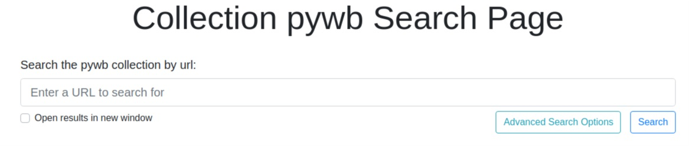
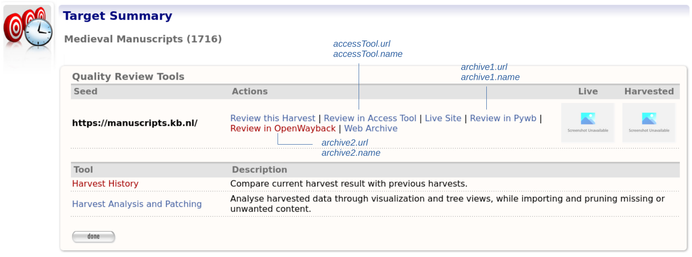

=========================
Wayback Integration Guide
=========================

Introduction
============

In order to use Wayback as an review tool within WCT, you need to deploy and configure an instance of Wayback to run
inside a Tomcat container. It is this instance of Wayback that performs the indexing.

This guide shows how to deploy and configure an instance of Wayback to run inside a Tomcat container.

Contents of this document
-------------------------

Following this introduction, the Wayback Integration Guide includes the following sections:

-   **OpenWayback or Pywb** - Covers the replay options.

-   **Installation** - Covers installing OpenWayback.

-   **Configuration** - Covers configuring OpenWayback.

-   **OpenWayback as a Review Tool in WCT** - Covers configuring OpenWayback for use as a review tool in the Web Curator Tool.

-   **Testing** - Covers testing the OpenWayback installation.

-   **More information** - Provides some links for more information.

OpenWayback or Pywb
===================================

There are a number of options for replay, including `OpenWayback <http://netpreserve.org/openwayback>`_
and `PyWB <https://pywb.readthedocs.io/en/latest/>`_. Web Curator Tool was originally
developed and tested with Wayback however OpenWayback and PyWB are more actively developed at the moment. 

Here is an `explanation <https://github.com/iipc/openwayback/wiki/General-overview>`_ of the history and differences
between OpenWayback and predecessor Wayback. For documentation on Pywb click `here <https://pywb.readthedocs.org/>`_.

Downloading
-----------

`Download OpenWayback <https://github.com/iipc/openwayback/releases>`_.

`Download PyWB <https://github.com/webrecorder/pywb>`_.

Installation
============

The OpenWayback Wiki contains a useful `install guide <https://github.com/iipc/openwayback/wiki/How-to-install>`_ and
`configuration guide <https://github.com/iipc/openwayback/wiki/How-to-configure>`_.

PyWB has useful setup information to `get started <https://pywb.readthedocs.io/en/latest/manual/usage.html#getting-started>`_ and
`configure <https://pywb.readthedocs.io/en/latest/manual/configuring.html>`_ your archive, keep in mind that PyWB is
set up differently to OpenWayback.  Unlike OpenWayback, which runs in Tomcat, PyWB runs on its own Gevent server so
you will need to keep in mind which port you want to run PyWB on.  You will also need to factor in the file structure
of the archive and where WCT is storing the warcs.

Once you have the tool running in Tomcat or Gevent and can see the homepage in your browser then you are ready to configure the
interaction with WCT.

|OpenWayback_home|

|PyWB_home|

Configuration
=============

*Please note: This does not cover PyWB configuration.*

The easiest configuration to get WCT and OpenWayback working together is to leave OpenWayback with its default setting of
indexing using BDB (instead of CDX). As OpenWayback indexes by watching a folder for new files, we need to configure WCT to
copy new harvests to a common location between the two. *Note you don't have to move where WCT is storing your harvests,
this is an extra location common to WCT and OpenWayback.*

In this example our common location will be `/wct/wayback/`.

-   WCT will copy our warc/arc files to `/wct/wayback/store/`, and OpenWayback will be watching this folder for any new files
    to index.

-   The indexes that OpenWayback creates will be in `/wct/wayback/index-data/merged/`.

-   Shut down Tomcat

-   Open your WCT Store `application.properties` file and make the following changes. (`application.properties` is located in
    `webcurator-store.war/WEB-INF/classes/application.properties`)::

        #WaybackIndexer
        # Enable this indexer
        waybackIndexer.enabled=true
        # Frequency of checks on the merged folder (milliseconds)
        waybackIndexer.waittime=1000
        # Time to wait for the file to be indexed before giving up (milliseconds)
        waybackIndexer.timeout=300000
        # Location of the folder Wayback is watching for auto indexing
        waybackIndexer.waybackInputFolder=/wct/wayback/store
        # Location of the folder where Wayback places merged indexes
        waybackIndexer.waybackMergedFolder=/wct/wayback/index-data/merged
        # Location of the folder where Wayback places failed indexes
        waybackIndexer.waybackFailedFolder=/wct/wayback/index-data/failed

-   Open your `wayback.xml` file and change the `wayback.basedir` path. (`wayback.xml` is located in
    `/<path to tomcat>/webapps/wayback/WEB-INF/`)::

        <bean class="org.springframework.beans.factory.config.PropertyPlaceholderConfigurer">
            <property name="properties">
              <value>
                wayback.basedir=/wct/wayback
                wayback.urlprefix=http://localhost:8080/wayback/
              </value>
            </property>
        </bean>

-   Open your `BDBCollection.xml` file and change the prefix property. (`BDBCollection.xml` is located in
    `/<path to tomcat>/webapps/wayback/WEB-INF/`)::

        <bean id="datadirs" class="org.springframework.beans.factory.config.ListFactoryBean">
            <property name="sourceList">
              <list>
                <bean class="org.archive.wayback.resourcestore.resourcefile.DirectoryResourceFileSource">
                  <property name="name" value="files1" />
                  <property name="prefix" value="${wayback.basedir}/store/" />
                  <property name="recurse" value="false" />
                </bean>
              </list>
            </property>
        </bean>

Inside our common location OpenWayback will create the following folder structure. (`/index-data/merged/` is where the
completed indexes are stored. Their file names exactly match the name of their corresponding warc/arc file, including
the extension)::

    file-db/db
    file-db/incoming
    file-db/state
    index
    index-data/failed
    index-data/incoming
    index-data/merged
    index-data/queue
    index-data/tmp

PyWB Configuration
==================

PyWB is different to OpenWayback in that it requires a collection to be initialised, it uses .cdxj as
index files, and it runs on a separate Gevent server.  *If you intend to use PyWB along with another Wayback tool*
*you might want to either configure the waybackIndexer.waybackInputFolder within application.properties to the*
*initialised PyWB archive directory collections/collectionName/archive or symlink the initialised PyWB archive*
*directory with the directory you have used for waybackIndexer.waybackInputFolder.*  This way PyWB will always
get a copy of the warc files that are being generated.

When you run the PyWB server you can specify the port using -p.  Using -a will ensure that the initialised
PyWB archive directory is checked every 30 seconds for new warcs to index.  Any warc files that are manually
added in will be indexed within *indexes/index.cdxj* and any warc files that are indexed using the autoindex
setting will be indexed within *indexes/autoindex.cdxj*.

OpenWayback as a Review Tool in WCT
===================================

In order to use OpenWayback as a review tool inside WCT, there are some more configuration changes.

First take note of the url that OpenWayback is running from inside Tomcat. This should match the `wayback.urlprefix`
property we saw above in `wayback.xml`. In our example it is http://localhost:8080/wayback/.

Open your WCT Webapp `application.properties` file and make the following changes. (`application.properties` is located in
`webcurator-webapp.war\WEB-INF\classes\application.properties`)::

    harvestResourceUrlMapper.urlMap=http://localhost:8080/wayback/{$ArcHarvestResource.FileDate}/{$HarvestResource.Name}
    qualityReviewToolController.enableBrowseTool=true
    qualityReviewToolController.enableAccessTool=true
    qualityReviewToolController.archiveUrl=http://localhost:8080/wayback/*/

Using Multiple Review Tools in WCT
==================================

Within the Target Summary for the harvest you will have options for different Quality Review Tools.  There will
be a link to Review in Access Tool plus other links to other archives which you can specify the name of.  All
of these links are configurable via WCT Webapp `application.properties`.

-   Review in Access Tool uses the value set in harvestResourceUrlMapper.urlMap
-   qualityReviewToolController.archiveName uses the value set in qualityReviewToolController.archiveUrl
-   qualityReviewToolController.archive.alternative.name uses the value set in qualityReviewToolController.archive.alternative

|Review_Tools|

Testing
=======

Once you have restarted Tomcat, schedule a harvest to test the integration.

-   When the harvest is completed, you should see it's warc/arc file copied to `/wct/wayback/store`

-   When the indexing is complete, you should see the index file in `/wct/wayback/index-data/merged`

-   Inside WCT - Under the *Harvest Results* tab for a Target Instance, *Review* your completed harvest.

    |screenshot_TargetSummary_HarvestResults|

-   Choose the option to 'Review in Access Tool' to view the harvest in Wayback.

    |screenshot_TI_ReviewTools|

More information
================

The following guides can provide additional information:

-   :doc:`System Administrator Guide <system-administrator-guide>`

-   :doc:`Developer Guide <developer-guide>`

-   :doc:`Troubleshooting Guide <troubleshooting>`

-   :doc:`FAQ <faq>`

.. |Wayback_home| image:: ../_static/wayback-integration-guide/Wayback_home.jpg
   :width: 672.0px
   :height: 232.0px
   :alt: The Wayback Machine banner

.. |OpenWayback_home| image:: ../_static/wayback-integration-guide/OpenWayback_home.jpg
   :width: 677.0px
   :height: 179.0px
   :alt: The OpenWayback banner

.. |screenshot_TargetSummary_HarvestResults| image:: ../_static/wayback-integration-guide/screenshot_TargetSummary_HarvestResults.jpg
   :width: 646.0px
   :height: 244.0px
   :alt: Target Summary Harvest Results

.. |screenshot_TI_ReviewTools| image:: ../_static/wayback-integration-guide/screenshot_TI_ReviewTools.jpg
   :width: 608.0px
   :height: 262.0px
   :alt: Target Instance - Review Tools

